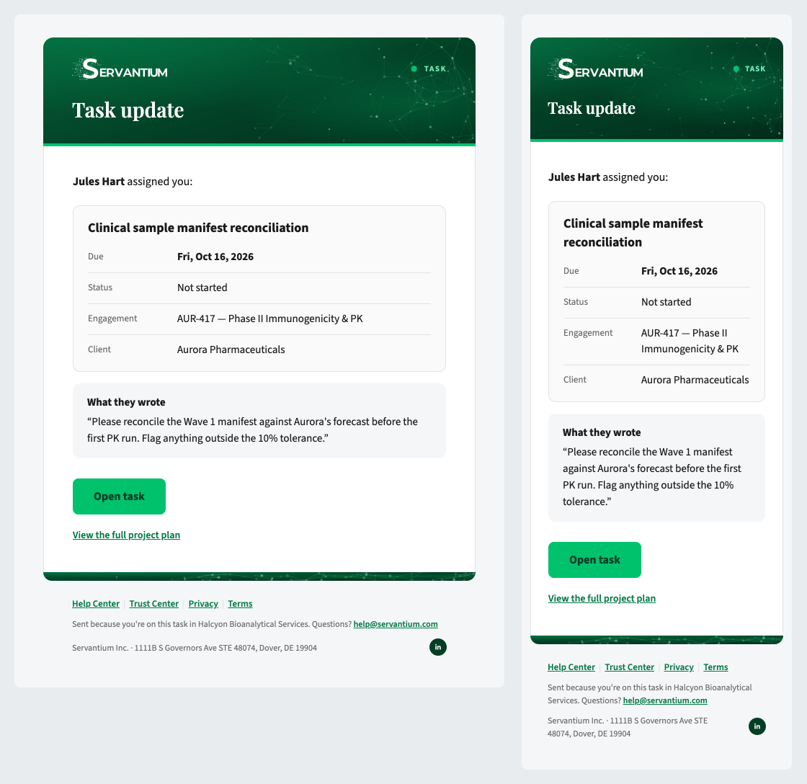

# Writing an email: the task email, step by step

This walks through designing one real email from a blank page: the message a customer gets when something happens to a task they're on. The finished master is [`src/emails/task.mdx`](../src/emails/task.mdx). Every decision below is one you'll make for any new email.



## 1. Start from the moment, not the layout

Before touching a component, answer three questions in plain words:

| Question | For the task email |
|---|---|
| What happened? | Someone did something to a task: assigned it, commented, moved the date, completed it. |
| Who gets it? | The people on that task, in one organization. |
| What should they do next? | Open the task. |

Two consequences fall out straight away:

- **One email, not four.** Assigned, commented, rescheduled and completed look the same and ask for the same action. One template with an `action` field ("assigned you", "commented on") beats four near-identical templates to keep in step.
- **One button.** The email exists to get the reader into the task. Everything else supports that.

If you can't answer the third question, you may not need an email at all. A digest row or an in-app notification might be enough.

## 2. Set the frame in the frontmatter

The frontmatter builds everything around the content: the banner, the footer and the Postmark stream. You never place a banner or footer yourself.

```yaml
name: Task message
label: Task
title: Task update
stream: transactional
footer:
  reason: "Sent because you're on this task in {{ organization_name }}."
```

| Key | Choice | Why |
|---|---|---|
| `stream` | `transactional` | The reader needs this to do their job; it must arrive even if they've unsubscribed from product news. `broadcast` is only for mail people can opt out of, like release notes. |
| `tone` | *(left out: default)* | Ask "is something wrong?" No, so the tone is default. `attention` is for "act soon", `urgent` for "broken now". |
| `label` | `Task` | The kind of email, top-right of the banner. 16 characters at most. |
| `title` | `Task update` | The banner's one line. It's **the same on every send**, 24 characters at most, and can't contain fields. The specifics (who, which task) go in the subject and the body, where they have room. |
| `footer.reason` | "Sent because you're on this task in…" | Every email says why it arrived, in one sentence of 90 characters or fewer. If you can't write this line, don't send the email. |

## 3. Write the subject and preheader

These are what people actually read in the inbox, so they carry the event:

```yaml
subject: "{{ actor_name }} {{ action }}: {{ task_name }}"
preheader: "Due {{ due }} · {{ engagement }}"
```

Filled in, that reads:

> **Jules Hart assigned you: Clinical sample manifest reconciliation**
> Due Fri, Oct 16, 2026 · AUR-417 — Phase II Immunogenicity & PK

The subject says what happened. The preheader adds what the subject doesn't: when it's due and where it belongs.

## 4. List the data, then name it

Write down every fact the email shows, then turn each one into a **field**. Fields are the contract with engineering: the backend supplies exactly these values, and the build fails if the email uses a field it didn't declare, or declares one it never uses.

```yaml
fields:
  actor_name: { example: Jules Hart, note: Who did it }
  action: { example: assigned you, note: "Lower-case, reads after the name: assigned you · commented on · changed the due date of · completed" }
  task_name: { example: Clinical sample manifest reconciliation }
  due: { example: "Fri, Oct 16, 2026", note: Formatted for the recipient }
  status: { example: Not started, note: The task's status as the app shows it }
  engagement: { example: "AUR-417 — Phase II Immunogenicity & PK", note: Engagement code and name }
  client: { example: Aurora Pharmaceuticals }
  message: { example: "Please reconcile the Wave 1 manifest…", optional: true, note: "The comment that came with the event. Leave it out and the panel doesn't appear." }
  task_url: { example: "https://app.servantium.com/engagements/eng-aur-417/project_plans?task=ppi-manifest" }
  plan_url: { example: "https://app.servantium.com/engagements/eng-aur-417/project_plans", optional: true }
  organization_name: { example: Halcyon Bioanalytical Services }
```

The choices behind them:

- **Name the thing, not the slot.** `due`, not `row_2_value`; `task_url`, not `button_link`. The name should still make sense if the layout changes.
- **The sender formats; the template never does.** `due` arrives as "Fri, Oct 16, 2026", already in the reader's time zone. Postmark prints text exactly as it receives it; it can't format a date or a currency.
- **Write the note for whoever wires it.** `action` has a note listing the verbs, because "lower-case, reads after the name" is the difference between "Jules Hart assigned you" and "Jules Hart Assigned".
- **Mark what can be missing.** Not every event carries a comment, so `message` is `optional: true`. The panel that shows it disappears when it's left out.
- **Use real-looking examples.** They fill the preview gallery and become Postmark's test data. They're never sent.

The full naming and formatting rules are in [fields.md](./fields.md).

## 5. Choose the components

Now lay out the body. Plain Markdown covers most of it; reach for a component when the content has a shape.

| Content | Component | Why this one |
|---|---|---|
| "Jules Hart assigned you:" | a paragraph (`Text`) | One sentence that says what happened. The banner doesn't repeat it. |
| Task name, due date, status, engagement, client | `DataTable` | Facts people look up rather than read: label on the left, value on the right. The task name goes in `title`, so the table reads as a card about that task. |
| The comment, if there is one | `If` + `Callout tone="neutral"` | Someone's words, set apart from ours. Neutral, because a comment isn't a warning. Wrapped in `If` so it vanishes when `message` is missing. |
| "Open task" | `Button` (primary) | The one action. Primary, because this email exists for it. |
| "View the full project plan" | `If` + `Link` | A second, optional destination, so a link and not a second button. |

What we didn't use, and why:

- **`Callout` for the due date.** A callout is for the one thing a reader must not miss, like a security warning. A due date is a fact; bold it in the table.
- **`Items` for the facts.** Items is for titled paragraphs, like release highlights. Short label and value pairs belong in a table.
- **A second button for the plan.** Two filled buttons compete, and the tests allow one primary per email.

## 6. Write the master

```mdx
---
(the frontmatter from steps 2 to 4)
---
<Text margin="0 0 20px"><b>{{ actor_name }}</b> {{ action }}:</Text>

<DataTable title="{{ task_name }}" labelWidth={112} rows={[
  ["Due", <b>{"{{ due }}"}</b>],
  ["Status", "{{ status }}"],
  ["Engagement", "{{ engagement }}"],
  ["Client", "{{ client }}"],
]} />

<If field="message">
  <Spacer size={16} />
  <Callout tone="neutral" title="What they wrote">“{{ . }}”</Callout>
</If>

<Spacer size={28} />

<Button href="{{ task_url }}" width={180}>Open task</Button>

<If field="plan_url">
  <Spacer size={18} />
  <Text size="sm" margin="0"><Link href="{{ . }}">View the full project plan</Link></Text>
</If>
```

How fields get into it:

- **In text**, just type `{{ field }}`.
- **In a component prop**, it's a string: `href="{{ task_url }}"`, or `"{{ status }}"` inside `rows`.
- **To style a field inside a prop**, wrap it in a tag with the string inside braces: `<b>{"{{ due }}"}</b>`.
- **Inside `<If field="x">`**, the value is `{{ . }}`, and nothing else is visible. Postmark scopes sections this way, so the build refuses `{{ task_name }}` inside `<If field="message">`. It would print nothing.
- **Spacing:** paragraphs space themselves; components don't. Put a `Spacer` before a callout or button.

## 7. Build, look, test

```bash
npm run build          # compile every master into dist/
open dist/task.html    # the email with its examples filled in
open dist/index.html   # every email, at desktop and phone width
npm test               # the rules
```

Check the preview at phone width, and then check it again with the optional fields missing. The tests do this too, but look anyway.

When a rule breaks, the build or the tests say so in a sentence. A few you might meet:

| Message | Fix |
|---|---|
| `title` is 31 characters; the banner fits 24 on one line | Shorten it. Move the detail to the subject or body. |
| uses `{{ due_date }}` but doesn't declare it under `fields` | Declare it, or fix the typo. |
| declares `client` under `fields` but never uses it | Use it or delete it. Unused fields confuse whoever wires the email. |
| `{{ task_name }}` inside the `message` section — only the section's own value ({{ . }}) is allowed there | Move it outside the `<If>`. |
| task has more than one primary button | Make the second one `variant="secondary"`, or a link. |

## 8. What engineering gets

The build turns the master into everything the backend needs, and nothing it has to render itself:

- **`dist/postmark/task/`**: the template, its plain-text version and its metadata, ready for Postmark. A release bundles these.
- **`dist/contract.json`**: the task entry, with its stream, sender, reply-to, subject and every field with its note and example.
- **`dist/servantium_email_contract.py`**: the same contract as a Python type, `TaskData`, where optional fields are `NotRequired`.

Sending it is one Postmark call, by alias, with the data. Engineering owns that code; this is what it looks like:

```json
POST https://api.postmarkapp.com/email/withTemplate
{
  "From": "Servantium <notifications@servantium.com>",
  "To": "priya.nair@halcyon.example",
  "ReplyTo": "help@servantium.com",
  "MessageStream": "outbound",
  "TemplateAlias": "task",
  "TemplateModel": {
    "actor_name": "Jules Hart",
    "action": "assigned you",
    "task_name": "Clinical sample manifest reconciliation",
    "due": "Fri, Oct 16, 2026",
    "status": "Not started",
    "engagement": "AUR-417 — Phase II Immunogenicity & PK",
    "client": "Aurora Pharmaceuticals",
    "task_url": "https://app.servantium.com/engagements/eng-aur-417/project_plans?task=ppi-manifest",
    "organization_name": "Halcyon Bioanalytical Services"
  }
}
```

`message` and `plan_url` are left out here, so the comment panel and the plan link don't appear.

## 9. Ship it

Open a pull request. The workflow builds, runs the tests and attaches the rendered gallery to the run, so reviewers can look at the email without building anything. Engineering reviews the frontmatter, because it's the contract. After it merges, a release tag packages the templates for engineering to push into Postmark. [maintaining.md](./maintaining.md) covers the release steps and what to do when a change affects the data.

## Variations you'll meet

| If the email needs… | Do this |
|---|---|
| A comment that can run to several paragraphs | Make it a list field of `{ text }` items and use `<Paragraphs field="…" />`. Outlook ignores line breaks inside one field, so the sender splits the text on blank lines. |
| A list whose length varies (subtasks, updates) | A list field, repeated by `<Updates field="…" />` or `<DataTable each="…" />`. |
| Rows that differ by event | `<DataTable each="details" />` with `{ label, value }` items, like [`notification.mdx`](../src/emails/notification.mdx). |
| Words an admin might want to change later | `<Editable field="…">default copy</Editable>`. The default shows until the sender passes a value. |
| A link to the help center, trust center or app | `<CompanyLink to="help">Help Center</CompanyLink>`, or `<Button to="trust">`. The address comes from `company.json`. |
| Something is wrong | `tone: attention` or `tone: urgent` in the frontmatter, never a red paragraph. |

## Checklist

- [ ] The subject says what happened; the preheader adds something new.
- [ ] `title` is the same on every send and 24 characters or fewer.
- [ ] `footer.reason` explains, in one sentence, why this person got it.
- [ ] Every field has a snake_case name, a realistic example, and a note wherever the format matters.
- [ ] Anything that can be missing is `optional: true` and wrapped in `<If>`.
- [ ] One primary button, with a verb and object label ("Open task").
- [ ] Checked at phone width, and with the optional fields missing.
- [ ] `npm test` passes.
